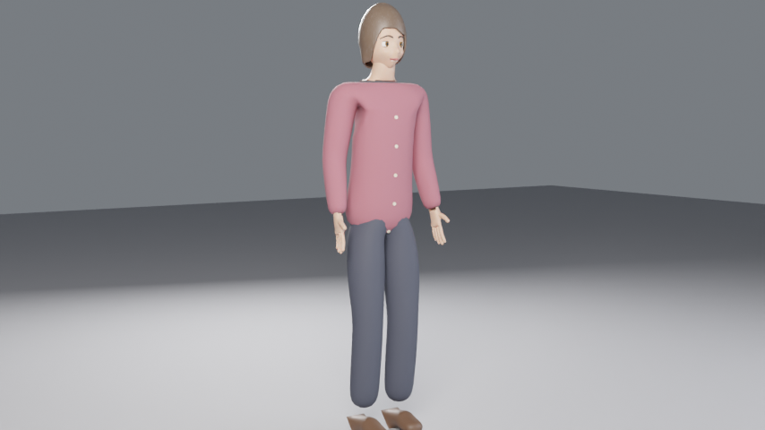

# Woman 50 — персонаж по координатам скелета

| Файл | Что это |
|---|---|
| `woman50_bone_coordinates.txt` | **исходные координаты** (скрипт читает их при каждом запуске) |
| `woman50.py` | сборка персонажа: риг + тело + голова + одежда + лицевые контролы |
| `render_woman50.py` | превью 480p + демо-анимация 4 с (проверка рига) |
| `source/woman50_blender_rig.py` | исходный скрипт метарига Rigify (для справки) |
| `out/woman50.blend` | готовая сцена: персонаж, свет, камера, демо-анимация |
| `out/woman50_demo.mp4` | демо 854×480: машет рукой, улыбается, моргает, говорит |
| `out/preview_*.png` | контрольные кадры |

## Что внутри

- **Риг `Woman50_Rig`** — все кости из файла с координатами и иерархией (тело + `ctrl_*` лица)
  + пальцы (по 2 фаланги, большой палец). Rigify не нужен, риг работает сразу.
- **Тело** — по суставам; под одеждой скрыто модификатором `HideUnderClothes`
  (выключи его, если переодеваешь персонажа).
- **Одежда отдельными мешами:** кардиган с пуговицами, брюки, домашние туфли — веса перенесены с тела.
- **Голова:** нос, щёки, подбородок, уши, рот с полостью, губы, зубы, язык, глаза
  (радужка/зрачок), веки с линией ресниц, брови, причёска «боб» с проседью.

## Как оживлять

| Действие | Как |
|---|---|
| Открыть рот | кость `ctrl_jaw`, поворот X ≈ +14° (или `woman50.jaw_open(arm, 1.0)`) |
| Моргнуть | `ctrl_lid_top.*` X ≈ +62°, `ctrl_lid_bot.*` X ≈ −12° (или `woman50.blink(arm, 1.0)`) |
| Взгляд | `ctrl_eye.L/R`, поворот Z (влево-вправо) и X (вверх-вниз) |
| Эмоции | Shape Keys на голове/губах/бровях: `smile`, `frown`, `mouth_O`, `brow_up`, `cheek_puff` (или `woman50.face_key(arm, "smile", 1.0)`) |
| Язык / зубы | `ctrl_tongue`, `ctrl_teeth_up`, `ctrl_teeth_lo` |
| Тело | обычные кости `spine…`, `upper_arm.*`, `forearm.*`, `hand.*`, `f_*` (пальцы), `thigh.*`… |

Веки: точка вращения перенесена в центр глаза (в файле — у края века), иначе при моргании веко
съезжает с глазного яблока. Остальные координаты — точно по файлу.

## Запуск

- Blender → Scripting → Open → `woman50.py` → Run Script — персонаж в текущей сцене.
- Превью и демо: `blender -b -P render_woman50.py -- --out ./out`
- Из сценария ролика: `import woman50; rig = woman50.build(clear=False, location=(x, y, 0))`.
