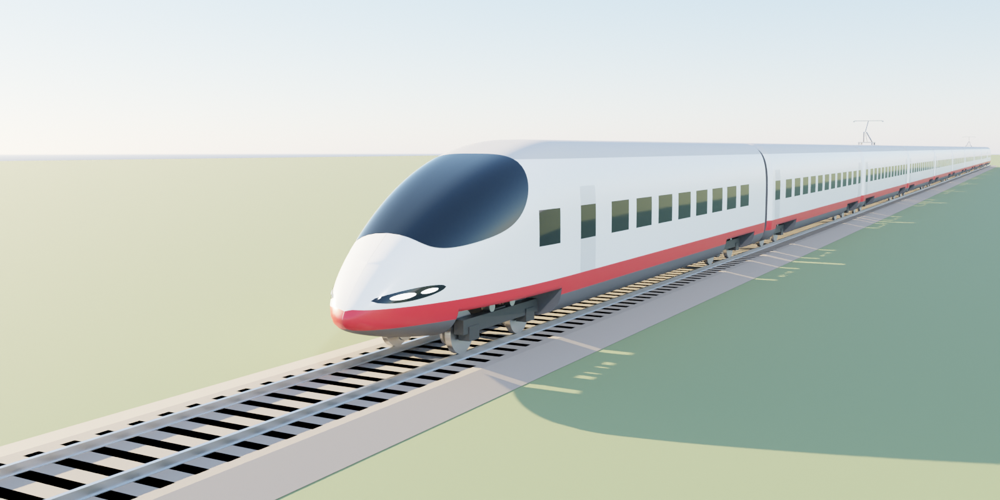

# Сапсан (Siemens Velaro RUS, ЭВС1/ЭВС2) — процедурная модель Blender

Модель строится Python-скриптом по открытым техническим данным (не по заводской КД Siemens).



## Файлы

| Файл | Что это |
|---|---|
| `sapsan_velaro_rus.py` | генератор модели: все размеры — параметры вверху файла |
| `render_preview.py` | строит модель, рендерит превью (Cycles), экспортирует `.blend` и `.glb` |
| `out/sapsan_velaro_rus.blend` | готовая сцена: состав, путь, свет, небо, камеры |
| `out/sapsan_velaro_rus.glb` | та же модель для других программ / движков |
| `out/preview_*.png` | контрольные рендеры |
| `sapsan_cinematic.py` | ролик 30 с: поезд едет, 7 планов камеры со склейками |
| `out/sapsan_cinematic.blend` | готовая сцена ролика (EEVEE, 1920×1080, 25 fps, 750 кадров) |
| `out/sapsan_cinematic_preview.mp4` | превью 960×540, первые 11,6 с (планы 1–3; облачный CPU-рендер остановлен) |

## Как открыть

- **Готовая модель:** открыть `out/sapsan_velaro_rus.blend` (Blender 4.2+ / 5.x).
- **Сгенерировать заново в Blender:** Scripting → Open → `sapsan_velaro_rus.py` → Run Script.
  Скрипт очищает текущую сцену и строит состав заново.
- **Из командной строки:**
  ```
  blender -b -P sapsan_velaro_rus.py -- --out ./out
  blender -b -P render_preview.py -- --out ./out --samples 64
  ```

## Система координат (1 ед. = 1 м, отображение в мм)

- **X** — вдоль состава, 0 = нос вагона 1, хвост = 244 470 мм
- **Y** — поперёк, 0 = ось пути, кузов ±1 632,5 мм
- **Z** — вверх от уровня головки рельса, крыша 4 400 мм, пол 1 360 мм

## Что заложено

| Параметр | Значение |
|---|---|
| Вагоны | 2 головных × 25 535 мм + 8 промежуточных × 24 175 мм |
| Ширина / высота кузова | 3 265 / 4 400 мм |
| Колея | 1 520 мм |
| База тележки | 2 500 мм, колесо Ø920 |
| Центры тележек | головной 4 080 / 21 455, промежуточный 3 400 / 20 775 от начала вагона |
| Токоприёмники | вагоны 3 и 8 |

Проверено скриптом: габарит кузовов X 0…244 470, Y ±1 632,5, Z 0…4 400 мм;
центры тележек совпадают с таблицей (например, вагон 2 — 28 935 / 46 310, вагон 10 — 223 015 / 240 390).

## Условности (нет в открытых данных — подобрано по фото)

Форма носа (длина обтекателя 7 м), сечение кузова (суперэллипс), лобовое стекло, раскладка окон
(шаг 1 750 мм) и дверей, ливрея, упрощённые тележки, переходы и токоприёмники.
Всё это задаётся константами в начале `sapsan_velaro_rus.py` (`NOSE_LENGTH`, `WIN_PITCH`,
`WINDSHIELD`, `car_openings()` и т. д.) — если есть точные размеры, их легко подставить.

## Ролик (`sapsan_cinematic.py`)

Состав идёт 200 км/ч по перегону ~2,3 км: путь со шпалами, контактная сеть через 60 м,
лесополосы, поле. Колёсные пары вращаются синхронно со скоростью, включён motion blur.

| # | Кадры | Время | План |
|---|---|---|---|
| 1 | 1–100 | 0–4 с | засада у полотна: поезд вылетает из дали и проносится мимо, наезд → широкий угол |
| 2 | 101–210 | 4–8,4 с | дрон: облёт головы сверху, с левой стороны на правую |
| 3 | 211–290 | 8,4–11,6 с | крупно: тележка и колёса у самого рельса |
| 4 | 291–390 | 11,6–15,6 с | камера впереди поезда, лоб «несётся на нас» |
| 5 | 391–490 | 15,6–19,6 с | вдоль крыши к токоприёмнику 3-го вагона |
| 6 | 491–630 | 19,6–25,2 с | общий план с высоты над полем, панорама за составом |
| 7 | 631–750 | 25,2–30 с | финал: хвост уходит вдаль, камера поднимается и делает наезд |

Склейки — маркеры таймлайна, привязанные к камерам. Скорость (`SPEED_KMH`), длительность,
ракурсы (`build_shots()`) — всё правится в скрипте.

**Рендер у себя (лучше всего на видеокарте):**
1. Открыть `out/sapsan_cinematic.blend` **или** запустить `sapsan_cinematic.py` во вкладке Scripting
   (при запуске скрипта формат вывода сразу ставится в MP4).
2. Render → Render Animation (Ctrl+F12). Результат: `render/sapsan_cinematic_0001-0750.mp4` рядом с .blend.
   Если в Output стоит PNG — выбрать File Format: FFmpeg Video, Container MPEG-4, Codec H.264.

Из командной строки:
```
blender -b -P sapsan_cinematic.py -- --out ./anim --render --engine EEVEE --res 1920x1080
```
